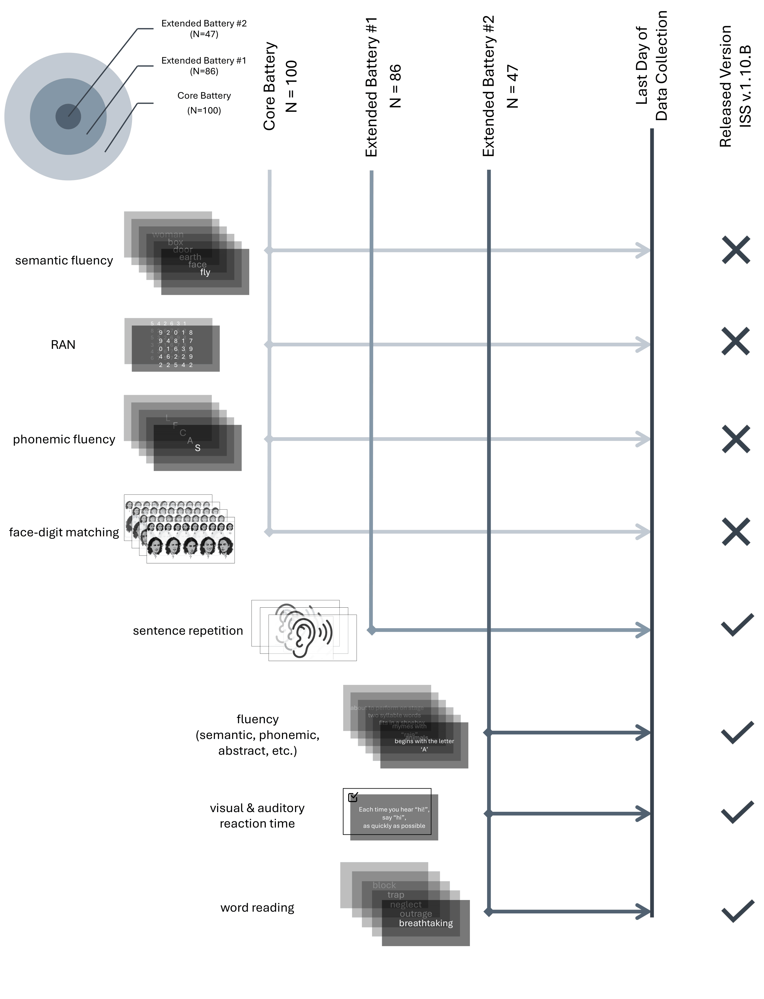

# Iowa Speech Sample Pipeline — v1.10.B

[](https://hub.docker.com/repository/docker/melsadany/iowa_speech_sample/)
[](https://zenodo.org/records/18675411)

A fully containerized audio-to-features pipeline for the **Iowa Speech Sample (ISS)**. Given a participant's task recording, the pipeline segments audio, transcribes with **WhisperX**, cleans transcripts, and extracts a rich set of linguistic, temporal, semantic, phonetic, and acoustic features — all inside a single Docker image with no manual environment setup.



---

## Requirements

- **Docker** 20.10+
- **8 GB RAM** minimum; 16 GB recommended (WhisperX large-v3)
- **~30 GB** free disk space for the image and reference data

---

## Quick Start

### Pull and run

```bash
# Pull the image
docker pull melsadany/iowa_speech_sample:v1.0

# Create the expected directory layout
mkdir -p input output/cropped_audio output/transcriptions output/review_files output/features

# Place your audio file
mv YOUR_AUDIO_FILE.mp3 input/participant_audio.mp3

# Run
docker run --rm \
    -v $(pwd)/input:/input \
    -v $(pwd)/output:/app/output \
    melsadany/iowa_speech_sample:v1.0 \
    PARTICIPANT_ID \
    /input/participant_audio.mp3
```

Replace `PARTICIPANT_ID` with a session identifier (e.g., `SUBJ001`). Results appear in `output/features/`.

**Volume mounts:**

| Mount | Purpose |
|---|---|
| `/input` | Directory containing the audio file |
| `/app/output` | Pipeline outputs |
| `/app/reference_data` | Reference data (optional — bundled defaults used if omitted) |
| `/app/config` | Custom `task_template.yaml` (optional — bundled defaults used if omitted) |

### Build from source

```bash
git clone https://github.com/melsadany/iss-pipeline.git
cd iss-pipeline
docker build -t iowa_speech_sample:local .
```

---

## Recording the Task

A minimal browser app in `scripts/app/` guides participants and captures audio.

```bash
cd scripts/app
python3 -m http.server 8000
# open http://localhost:8000
```

Make sure `task_video.mp4` is in the same directory. In the app:

1. Click **Enable Microphone** and allow access.
2. Select **MP3** from the format dropdown.
3. Click **Start task** — the video plays and recording begins automatically.
4. When the video ends, a download link appears. Save the file as `participant_audio.mp3`.

---

## Pipeline Stages

| Stage | Script | Description |
|---|---|---|
| 1 | `run_01_audio_preprocessing.R` | Segments audio using task template timestamps |
| 2 | `02_transcription.py` | Transcribes segments with WhisperX (word-level alignment) |
| 3 | `run_03_transcription_cleanup.R` | Removes fillers, repetitions, and low-confidence words |
| 4 | `run_04_feature_extraction.R` | Extracts all features; calls Python wrappers for embeddings |

---

## Features Extracted

Features are aggregated at three levels:

| Level | Description |
|---|---|
| **Per-prompt** | Features for each prompt |
| **Per-task** | Averages across prompts, grouped by task type |
| **Per-participant** | Single-row summary for the full session |

**Task-specific metrics:**
- **CHECKBOX & HI** — hit rate, response latency
- **WORD_ASSOC** — constraint adherence, semantic/phonetic diversity, archetype switches, productivity slope, bin statistics
- **WMEMORY** — recall accuracy (exact match, Levenshtein, phonological similarity, recall order)
- **SENT_REP** — word-level and bigram accuracy, word order errors
- **READING** — correctness per word, reading latency by valence

**Embedding-based features:**
- **Semantic** (384-d, `all-MiniLM-L6-v2`) — prompt similarity, pairwise similarities, path length, TSP divergence, archetype assignment and area, spatial anchor similarity (visual, spatial, reasoning)
- **Phonetic** (300-d, PWESuite RNN) — same family of metrics; high-variance dimensions pre-selected

---

## Configuration

All pipeline parameters live in `config/task_template.yaml`. Key sections:

| Section | Controls |
|---|---|
| `task_settings` | Response windows, valid words (CHECKBOX/HI), constraint rules (WORD_ASSOC) |
| `transcription` | WhisperX model name, confidence thresholds, filler word lists |
| `ground_truth` | Target sentences for SENT_REP; reading word list with valence |
| `features` | Enable/disable acoustic, semantic, phonetic, linguistic, temporal groups |
| `spatial_anchors` | User-defined word lists for similarity calculations |
| `output` | What to save (per-trial, per-task, per-participant) |

---

## Reference Data

Pre-computed resources required by the pipeline are available on Zenodo:

**Download:** <https://zenodo.org/records/18675411>

| Directory | Contents |
|---|---|
| `embeddings/` | Semantic and phonetic embeddings for ~50k common words |
| `archetypes/` | Pre-computed archetype models (semantic and phonetic) |
| `linguistic/` | AoA, GPT familiarity, MRC, concreteness datasets |
| `task_metadata/` | ISS task template CSV |

---

## Outputs

```text
output/
├── cropped_audio/<participant_id>/          # WAV segments
├── transcriptions/<participant_id>/         # Raw WhisperX TSV files
├── review_files/
│   ├── <participant_id>_cleaned_transcription.tsv
│   └── <participant_id>_REVIEW_REQUIRED.xlsx   # only if flagged
└── features/
    ├── <participant_id>_transcription_cleaning_stats.rds
    ├── <participant_id>_tasks-minimal-features.rds
    ├── <participant_id>_per_prompt.rds
    ├── <participant_id>_per_task.rds
    ├── <participant_id>_per_participant.rds
    └── <participant_id>_all_features.rds
```

Most useful for downstream analysis:
- `*_per_participant.rds` — one row per participant with all aggregated scores
- `*_per_prompt.rds` — item-level data for each fluency prompt
- `*_per_task.rds` — one row per task type per participant

Convert RDS files with `readRDS()` in R or `pyreadr` in Python.

---

## Interactive / Debugging Mode

Override the entrypoint to get a shell inside the container:

```bash
docker run -it --rm --entrypoint /bin/bash \
    -v $(pwd)/input:/input \
    -v $(pwd)/output:/app/output \
    melsadany/iowa_speech_sample:v1.0
```

Pipeline scripts are in `/app/scripts/`. Each stage can be run manually — see the stage table above for script names and the source code for exact argument usage.

---

## Related

- Desktop app: <https://github.com/melsadany/iss-desktop-app>
- Docker image: <https://hub.docker.com/r/melsadany/iowa_speech_sample>
- Reference data: <https://zenodo.org/records/18675411>

---

## License

MIT. Maintainer: Muhammad Elsadany — [melsadany24@gmail.com](mailto:melsadany24@gmail.com)
